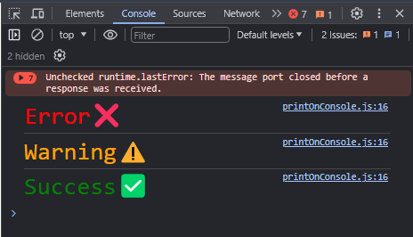

# log-styler

Brief description of your npm package.

## Installation

You can install this package via **npm i log-styler**:

npm install log-styler


## Usage
Examples
Provide usage examples or code snippets here.

```javascript I'm tab B
import logStyler from 'log-styler'

logStyler(
  {
    color: "red",
    backgroundColor: "white",
    fontFamily: "Dosis, sans-serif",
    fontSize: "30px",
    fontWeight: "bold",
    padding: "5px 15px",
    borderRadius: "5px",
    animation: "anim 0.5s infinite",
    border: "5px solid red",
  },
  "text here"
);
```


```bash
```

Parameters

| Parameter | Type     | Description  |
| :-------- | :------- | :----------- |
| `style`   | `object` | **Required** |
| `text`    | `string` | **Required** |

####

`logStyler({
    color: 'red',
    backgroundColor: 'white'
}, 'text here');`

Takes two Parameter and print on console.

## Authors

- [@VanshWebDev](https://github.com/VanshWebDev)

## Contributing

Contributions are always welcome!

See [contributing.md](https://github.com/VanshWebDev/log-styler/blob/main/contributing.md) for ways to get started.

## Demo

You can style as you want.



## 🚀 About Me

I'm a full stack developer...

## Connect with Me

Follow me on Instagram [@devloper.mind\_](https://www.instagram.com/devloper.mind_/)
