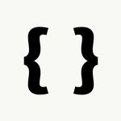

# log-styler

Brief description of your npm package.

## Installation

You can install this package via **npm i log-styler**:

````bash
npm install log-styler


## Usage

```python
import foobar

# returns 'words'
foobar.pluralize('word')

# returns 'geese'
foobar.pluralize('goose')

# returns 'phenomenon'
foobar.singularize('phenomena')
```bash

API Documentation
Document your package's API here.

Examples
Provide usage examples or code snippets here.

Contributing
If you'd like to contribute to this project, please follow these guidelines.

License
This project is licensed under the [License Name] - see the LICENSE.md file for details.


Replace placeholders like `Your Package Name`, `your-package-name`, `Feature 1`, `License Name`, and others with the appropriate information specific to your package. Additionally, you can include sections like Installation, Usage, Features, API Documentation, Examples, Contributing guidelines, and License information.

Make sure to provide detailed information to help users understand how to use your package and contribute to it if needed.
````

## Connect with Me



Follow me on Instagram [@devloper.mind\_](https://www.instagram.com/devloper.mind_/)
